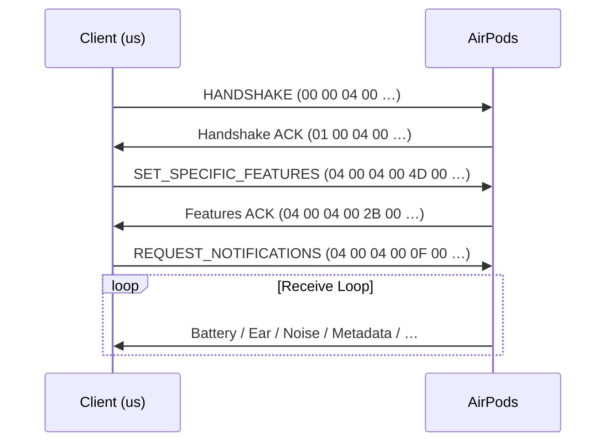

# Copilot Instructions

> **Pure-Rust AAP protocol engine — cross-platform core, platform-specific I/O.**
>
> ⚠️ If a change puts platform I/O in `librepods-core` or domain logic in `librepods-linux` → **REJECT**.

---

## Critical Rules (Auto-Reject)

```
❌ Platform / OS crate in librepods-core (nix, zbus, btleplug, tokio I/O)
❌ Protocol logic in librepods-linux or librepods-cli
❌ Missing AGPL-3.0-only header on new Rust source files
❌ New packet constant defined outside protocol/packets.rs
❌ ParsedPacket variant that silently drops data → use ParsedPacket::Unknown
❌ State mutation outside apply_to_state() in main.rs
❌ Hardcoded audio backend assumption (wpctl-only OR pactl-only)
❌ unwrap() on packet parsing / wire data
```

---

## Crate Boundary

| Crate | Allowed | Forbidden |
|---|---|---|
| `librepods-core` | `serde`, `thiserror`, `log`, `aes` | Any Bluetooth / OS / async-runtime I/O |
| `librepods-linux` | `nix`, `zbus`, `btleplug`, `tokio`, `libc` | Domain logic, packet parsing |
| `librepods-cli` | `clap`, `env_logger`, `tokio` | New protocol types |

> `librepods-core` must compile for `aarch64-linux-android`. This is the litmus test.

---

## AAP Packet Layout

Three packet families on the L2CAP wire. The first two bytes distinguish them.

### Standard data packet


- `opcode` (byte 4) — dispatch key; byte 5 is always `0x00` for known opcodes
- Parser validates the 4-byte `HEADER`, then dispatches on `packet[4]`

### Handshake / ACK packets (different first bytes)


> Parser checks Handshake ACK / Features ACK prefixes **before** standard header validation.

### Control command (sub-type of standard data, 11 bytes fixed)


---

## Handshake Sequence (Strict Order)



> Skipping a step or reordering → AirPods will silently ignore all subsequent packets.

---

## Adding a New Packet Type

1. Add opcode constant → `protocol/opcodes.rs`
2. Add prefix constant → `protocol/packets.rs`
3. Add `ParsedPacket` variant → `protocol/parser.rs`
4. Add match arm in `parse()` → `protocol/parser.rs`
5. Add state handling in `apply_to_state()` → `librepods-cli/src/main.rs`
6. Add unit test with raw bytes in same module

> Unknown / future opcodes → `ParsedPacket::Unknown(Vec<u8>)`. Never panic.

---

## Control Commands

```rust
// ✅ CORRECT — use the builder
ControlCommand::create(0x0D, &[0x02, 0x00, 0x00, 0x00])
ControlCommand::enabled(0x28)
ControlCommand::disabled(0x28)

// ❌ NEVER — hand-craft 11 bytes
let pkt = [0x04, 0x00, 0x04, 0x00, 0x09, 0x00, 0x0D, ...];
```

---

## Wire Data

- All AAP multi-byte values are **little-endian**
- BLE model IDs are **big-endian** (Apple convention)
- Battery status bytes: `0x01` = charging, `0x02` = discharging, `0x04` = disconnected
- Ear detection: `0x00` = in ear, non-zero = out

---

## Testing

```bash
cargo test                          # all workspace tests
cargo test -p librepods-core        # core only (must pass on any target)
cargo check -p librepods-core --target aarch64-linux-android  # cross-platform check
```

- Tests are inline `#[cfg(test)] mod tests` in each module
- Parser tests use raw byte arrays matching real packet captures
- Every `ParsedPacket` variant must have at least one parse round-trip test

---

## Linux Permissions

```bash
# Raw Bluetooth sockets require CAP_NET_RAW
sudo setcap cap_net_raw,cap_net_admin+eip ./target/release/librepods-cli

# Or just run with sudo for development
sudo RUST_LOG=debug cargo run -p librepods-cli -- --address AA:BB:CC:DD:EE:FF
```

---

## Media Control

- Detect backend at runtime: `wpctl` (PipeWire) → `pactl` (PulseAudio) → fallback
- Playback via `playerctl` → D-Bus MPRIS fallback
- Never assume which backend is present
- `is_airpods_active_sink()` must check before auto play/pause

---

## File Header (Required)

```rust
// LibrePods - AirPods liberated from Apple's ecosystem
// Copyright (C) 2025 LibrePods contributors
// SPDX-License-Identifier: AGPL-3.0-only
```

---

## Style

- Typed enums for all wire values (`#[repr(u8)]` + `from_byte()` + `as_byte()`)
- Explicit byte-offset comments on packet layouts
- Small pure functions, unit tested in same module
- `log::debug!` for packet hex dumps, `log::info!` for state changes
- `thiserror` for all error types — no ad-hoc strings

---

## Final Rule

```
Crate purity > Protocol correctness > Packet completeness > Feature count
```

> A parser that returns `Unknown` is correct. A parser that panics on bad wire data is **not**.

