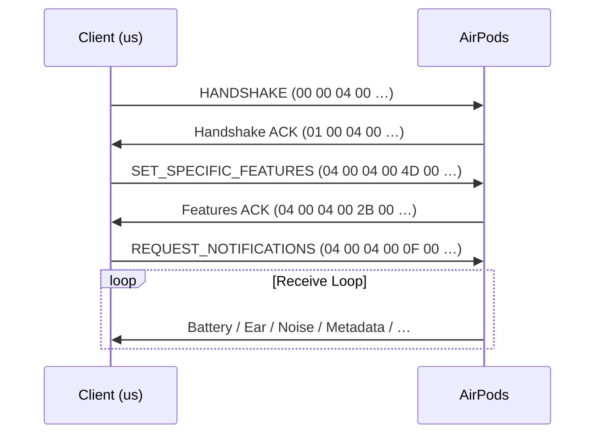

# LIBREPODS-RS

AirPods™ liberated from Apple's ecosystem — a pure-Rust implementation of the Apple Accessory Protocol (AAP), with a cross-platform core and platform-specific I/O.

## Overview

`librepods-rs` is an open-source tool that lets you use AirPods as first-class citizens on Linux. It speaks AAP over Bluetooth L2CAP to read battery levels, control noise cancellation, detect ear gestures, auto play/pause media, and more — all without needing an Apple device.

This is a clean-room Rust rewrite inspired by [LibrePods](https://github.com/kavishdevar/librepods) (Kotlin/C++), designed for embeddability, portability, and strict crate-boundary separation.

## Features

- **Battery Monitoring**: Real-time left/right/case battery levels and charging status
- **Noise Control**: Switch between Off, ANC, Transparency, and Adaptive modes
- **Ear Detection**: Automatic play/pause when you put in or take out your AirPods
- **Conversational Awareness**: Monitor and toggle CA status during audio playback
- **Long-Press Configuration**: Customize which noise control modes cycle on stem press
- **Rename**: Change your AirPods device name over AAP
- **BLE Advertisement Decoding**: Scan for nearby AirPods without pairing — see model, battery, lid state
- **Encrypted Battery**: AES-128 decryption of high-resolution battery data from BLE ads
- **Head Tracking**: Receive raw spatial audio head tracking sensor data
- **Device Metadata**: Read device name, model number, manufacturer
- **Media Control**: Automatic A2DP activation, PipeWire (`wpctl`) / PulseAudio (`pactl`) backend detection
- **Cross-Platform Core**: `librepods-core` is pure Rust with no OS dependencies — ready to be embedded in future platform targets

> **Note:** Some advanced features (Hearing Aid, Customize Transparency Mode, Multi-device connectivity) require changing the Bluetooth VendorID to Apple's. See [VendorID Configuration](#vendorid-configuration) below.

## Device Compatibility

| Model | Status | Notes |
|---|---|---|
| AirPods Pro 2 (USB-C) | ✅ Tested | Primary development device |
| AirPods Pro 2 (Lightning) | ✅ Tested | Same protocol as USB-C variant |
| AirPods Pro | ⚠️ Expected | Same protocol family, not yet verified |
| AirPods Max (Lightning) | ⚠️ Expected | Same protocol family, not yet verified |
| AirPods Max (USB-C) | ⚠️ Expected | Same protocol family, not yet verified |
| AirPods (4th gen, ANC) | ⚠️ Expected | Basic features should work |
| AirPods (4th gen) | ⚠️ Expected | Basic features (battery, ear detection) |
| AirPods (3rd gen) | ⚠️ Expected | Basic features (battery, ear detection) |
| AirPods (2nd gen) | ⚠️ Expected | Basic features (battery, ear detection) |
| AirPods (1st gen) | ⚠️ Expected | Basic features (battery, ear detection) |

The AAP protocol is consistent across all AirPods models (based on analysis of the macOS Bluetooth stack). Noise control, adaptive transparency, and conversational awareness are only available on models that support them in hardware.

## Architecture

```
┌──────────────────────────────────────────────────────────┐
│  librepods-cli          CLI daemon, state machine,       │
│                         clap, env_logger                 │
├──────────────────────────────────────────────────────────┤
│  librepods-linux        L2CAP socket (nix, libc),        │
│                         BlueZ D-Bus (zbus, tokio),       │
│                         BLE scan (btleplug),             │
│                         Media (wpctl / pactl / playerctl)│
├──────────────────────────────────────────────────────────┤
│  librepods-core         AAP parser, packet builder,      │
│                         device state, BLE ad decoder,    │
│                         transport traits                 │
│                         ⚠ NO platform I/O — pure Rust    │
└──────────────────────────────────────────────────────────┘
```

| Crate | Allowed deps | Purpose |
|---|---|---|
| `librepods-core` | `serde`, `thiserror`, `log`, `aes` | Protocol engine, device state, BLE parsing |
| `librepods-linux` | `nix`, `zbus`, `btleplug`, `tokio`, `libc` | Linux Bluetooth + media I/O |
| `librepods-cli` | `clap`, `env_logger`, `tokio` | Headless daemon |

## Prerequisites (Ubuntu / Debian)

### Build dependencies

```bash
sudo apt update
sudo apt install -y build-essential pkg-config curl \
    libdbus-1-dev libudev-dev
```

| Package | Why |
|---|---|
| `build-essential` | C linker for native crate build scripts |
| `pkg-config` | Finds `libdbus` and `libudev` at compile time |
| `libdbus-1-dev` | D-Bus headers — required by `zbus` (BlueZ monitor) and `btleplug` (BLE scan) |
| `libudev-dev` | udev headers — required by `btleplug` for device enumeration |

### Rust toolchain

```bash
curl --proto '=https' --tlsv1.2 -sSf https://sh.rustup.rs | sh
source "$HOME/.cargo/env"
```

### Bluetooth stack

```bash
sudo apt install -y bluetooth bluez
sudo systemctl enable --now bluetooth
```

Verify the adapter is up:

```bash
bluetoothctl show          # should print adapter info
```

### Audio & media (optional, for auto play/pause)

Ubuntu 22.04+ ships PipeWire by default. Install the CLI tools the daemon uses at runtime:

```bash
# PipeWire (recommended, Ubuntu 22.04+)
sudo apt install -y wireplumber

# — OR PulseAudio (older Ubuntu) —
sudo apt install -y pulseaudio-utils

# Playback control (play/pause on ear detection)
sudo apt install -y playerctl
```

> `librepods-cli` detects the backend automatically at startup: `wpctl` → `pactl` → fallback. No config needed.

### TL;DR — one-liner

```bash
sudo apt install -y build-essential pkg-config libdbus-1-dev libudev-dev \
    bluetooth bluez wireplumber playerctl \
  && curl --proto '=https' --tlsv1.2 -sSf https://sh.rustup.rs | sh
```

## Quick Start

### 1. Pair your AirPods

```bash
bluetoothctl
# scan on
# (wait for "AirPods" to appear, note the MAC address)
# pair AA:BB:CC:DD:EE:FF
# trust AA:BB:CC:DD:EE:FF
# connect AA:BB:CC:DD:EE:FF
# exit
```

### 2. Build & run

```bash
cargo build --release -p librepods-cli

# Bluetooth sockets require CAP_NET_RAW
sudo setcap cap_net_raw,cap_net_admin+eip ./target/release/librepods-cli

# Auto-detect connected AirPods
RUST_LOG=info ./target/release/librepods-cli

# Or specify address directly
RUST_LOG=info ./target/release/librepods-cli --address AA:BB:CC:DD:EE:FF
```

### 3. Scan for nearby AirPods (no pairing needed)

```bash
./target/release/librepods-cli --scan
```

Example output:

```
┌─────────────────────────────────────────────
│ 🎧 AirPods found!
│ Model:       AirPodsPro2Usbc
│ BLE address: XX:XX:XX:XX:XX:XX (random)
│ RSSI:        -42 dBm
│ Paired:      yes (to another device)
│ Left:        80%
│ Right:       90% ⚡
│ Case:        40%
│ Lid:         Open
│ Connection:  Idle
└─────────────────────────────────────────────
```

## CLI Options

```
Usage: librepods-cli [OPTIONS]

Options:
  -a, --address <ADDRESS>  Bluetooth address (e.g. "AA:BB:CC:DD:EE:FF")
      --retries <RETRIES>  Maximum connection retry attempts [default: 3]
  -s, --scan               Scan for nearby AirPods via BLE advertisements
      --no-media           Disable media control (no auto play/pause)
  -h, --help               Print help
```

## VendorID Configuration

Certain AirPods features (Hearing Aid, Customize Transparency Mode, Multi-device connectivity) are only enabled when the connected device identifies as an Apple device.

On Linux, you can change the Bluetooth VendorID by editing `/etc/bluetooth/main.conf`:

```ini
# Add this line to [General] section
DeviceID = bluetooth:004C:0000:0000
```

Then restart the Bluetooth service:

```bash
sudo systemctl restart bluetooth
```

> **Caution:** This changes how your machine identifies to *all* Bluetooth devices, not just AirPods. Revert the change if you experience issues with other devices.

## How It Works

### AAP Packet Layout

Three packet families on the L2CAP wire. The first two bytes distinguish them.

**Standard data packet:**


> Bytes 0–3 = `HEADER` &nbsp;│&nbsp; Bytes 4–5 = opcode (LE u16, byte 5 always `00`) &nbsp;│&nbsp; Bytes 6+ = data

**Handshake** (sent by us, 16 bytes):


**Handshake ACK** (from AirPods):


**Features ACK** (from AirPods — standard header, opcode `0x2B`):


**Control command** (sub-type of standard data, 11 bytes fixed):


### Handshake Sequence

Connection to AirPods requires a strict three-step handshake:



After the handshake, the AirPods push battery, ear detection, noise control, and other notifications continuously.

### Control Commands

Control commands use an 11-byte fixed layout:

```rust
use librepods_core::protocol::control_command::ControlCommand;

// Set noise cancellation mode
ControlCommand::create(0x0D, &[0x02, 0x00, 0x00, 0x00])

// Enable conversational awareness
ControlCommand::enabled(0x28)

// Disable conversational awareness
ControlCommand::disabled(0x28)
```

### BLE Advertisement Parsing

Decode Apple Proximity Pairing Messages without connecting:

```rust
use librepods_core::device::ble_advert::parse_advertisement;

// Raw Apple manufacturer data (company ID 0x004C already stripped)
let data: &[u8] = &[0x07, 0x19, 0x01, 0x24, 0x20, /* ... */];

if let Some(ad) = parse_advertisement(data) {
    println!("Model: {:?}", ad.model);
    println!("Left: {:?}%", ad.left_battery);
    println!("Right: {:?}%", ad.right_battery);
    println!("Case: {:?}%", ad.case_battery);
}
```

## Building & Testing

```bash
# Build all crates
cargo build

# Run all tests
cargo test

# Core only (must pass on any target)
cargo test -p librepods-core
```

## Troubleshooting

### `Permission denied` when connecting

Bluetooth L2CAP sockets require `CAP_NET_RAW`. Either:

```bash
# Option A: set capabilities on the binary (recommended)
sudo setcap cap_net_raw,cap_net_admin+eip ./target/release/librepods-cli

# Option B: run with sudo
sudo RUST_LOG=info ./target/release/librepods-cli
```

### `AF_BLUETOOTH not supported`

The Bluetooth kernel module isn't loaded:

```bash
sudo modprobe bluetooth
sudo systemctl restart bluetooth
```

### `No BLE adapter found` (when using `--scan`)

```bash
# Check adapter is present
hciconfig -a

# If powered off
sudo hciconfig hci0 up

# If no adapter shows up, check USB or verify driver
lsusb | grep -i bluetooth
dmesg | grep -i bluetooth
```

### `No audio backend found`

```bash
# Check what's running
pactl info 2>/dev/null && echo "PulseAudio OK" || echo "No PulseAudio"
wpctl status 2>/dev/null && echo "WirePlumber OK" || echo "No WirePlumber"

# Install what's missing
sudo apt install -y wireplumber        # PipeWire
# or
sudo apt install -y pulseaudio-utils   # PulseAudio
```

### AirPods connect but no data received

Make sure the AirPods service UUID is registered. Try re-pairing:

```bash
bluetoothctl
# remove AA:BB:CC:DD:EE:FF
# scan on
# pair AA:BB:CC:DD:EE:FF
# trust AA:BB:CC:DD:EE:FF
# connect AA:BB:CC:DD:EE:FF
```

## Development

```bash
# Run with debug logging
sudo RUST_LOG=debug cargo run -p librepods-cli -- --address AA:BB:CC:DD:EE:FF

# Or set capabilities once and run without sudo
sudo setcap cap_net_raw,cap_net_admin+eip ./target/debug/librepods-cli
RUST_LOG=debug ./target/debug/librepods-cli --address AA:BB:CC:DD:EE:FF
```

## Credits

This project is a Rust rewrite built upon the research and reverse engineering work of the [LibrePods](https://github.com/kavishdevar/librepods) project by [@kavishdevar](https://github.com/kavishdevar).

Special thanks to:
- [@tyalie](https://github.com/tyalie) — first public documentation of the AAP protocol ([AAP-Protocol-Definition](https://github.com/tyalie/AAP-Protocol-Defintion))
- [@rithvikvibhu](https://github.com/rithvikvibhu) and the Lagrange Point community — hearing aid feature research
- [@timgromeyer](https://github.com/timgromeyer) — first version of the LibrePods Linux app
- All [LibrePods contributors](https://github.com/kavishdevar/librepods/graphs/contributors) who decoded the protocol

---

*AirPods is a trademark of Apple Inc., registered in the U.S. and other countries and regions. All trademarks, logos, and brand names are the property of their respective owners. This project is not affiliated with, endorsed by, or sponsored by Apple Inc.*
